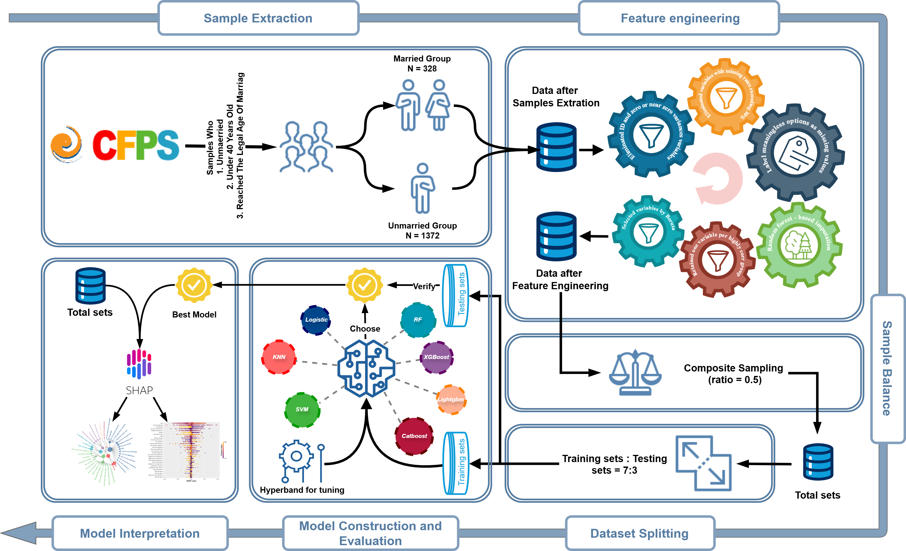

# 
Machine Learning-Based Prediction and Analysis of Chinese Youth Marriage Decision

This repository is uploaded as codes and data materials for the artical:"Machine Learning-Based Prediction and Analysis of Chinese Youth Marriage Decision", published on ***[Behavioral Sciences](https://www.mdpi.com/2076-328X/15/12/1750)***.

## Directory
- [Abstract](#Abstract)
- [Data Source](#Data-Source)
- [Software Verision](#Software-Version)
- [Flowchart](#Flowchart)
- [Files Interpretation](#Files-Interpretation)
- [Codes Interpretation](#Codes-Interpretation)
  - [Part1 Sample Extraction](#Part1-Sample-Extraction)
  - [Part2 Feature Engineering](#Part2-Feature-Engineering)
  - [Part3 Data Description](#Part3-Data-Description)
  - [Part4 Model Construction](#Part4-Model-Construction)
  - [Part5 Model Evaluation](#Part5-Model-Evaluation)
  - [Part6 SHAP calculation](#Part6-SHAP-calculation)
  - [Part7 SHAP visualisation](#Part7-SHAP-visualisation)
- [Copyright Statement](#Copyright-Statement)

## Abstract

  This study investigates the key factors that influence marriage decision among Chinese youth using machine learning techniques. Using data from the China Family Panel Studies (2018−2020), we extracted 1700 samples and filtered 26 significant variables. Seven machine learning algorithms were evaluated, with CatBoost emerging as the most effective. SHAP (SHapley Additive exPlanations) analysis revealed that work-related variables were the most strongly associated with predictions, accounting for 30% of the predictive power, followed by other factors such as demographic and education. Notably, we found that commute time and working hours exceeding 50 min/hours were negatively associated with marriage likelihood, while job satisfactions showed a non-linear relationship with marriage decision. The findings highlight the determinant of work–life balance in marriage decision and the complexity and non-linear relationship in social decision-making. The objective of this study is to provide scientific data support for policy makers in an era of declining marriage rates in China. This study not only reveals the key factors affecting marriage decision but also pro-vides critical evidence-based support for policymakers to prioritize resource allocation and formulate targeted policies amid declining marriage rates in China. 

## Data-Source

The data are from China Family Panel Studies (CFPS), funded by Peking University and the Nationl Natural Science Foundation of China. The CFPS is maintained by the Institute of Social Science Survey of Peking University. The data used are from the 2018 and 2020 survey waves.

*The CFPS data is restricted data that requires an application, I am not authorized to release the original file here, for the data file please visit  the [official website.](https://www.isss.pku.edu.cn/cfps/)

## Flowchart

## Files-Interpretation

The folder “data” contains the raw data as well as the processed data, where “cfps2018person.dta” and “cfps2020crossyearid.dta” are the raw files downloaded from CFPS (However, due to permission issues, the folder is empty here). The folder “Figure” contains eps vector versions of all images. The folder “Figure small” contains 300 dpi jpeg versions of all images. The folder “Table” contains several tables from the article. The remaining seven files with .R suffixes are the main code. The folder “Revision” contains the codes and auxiliary files generated during the peer review process.

## Codes-Interpretation

#### Part1-Sample-Extraction

This part is uesd to extract target samples from the raw data source who is between 20-40 and had not get married in 2018.[(code)](Part1_Sample_Extraction.R)

#### Part2-Feature-Engineering

This part is used to process the features, which include feature filtering, data interpolation, categorical variable coding, etc.[(code)](Part2_Feature_Engineering.R)

#### Part3-Data-Description

This part is used to output results of descriptive statistics and t-tests, chi-square tests, etc.[(code)](Part3_Data_Description.R)

#### Part4-Model-Construction

This part is used to set the basic model and tune hyperparameter. Output the tuned model and comparation result of basic model and tuned model finally.[(code)](Part4_Model_Construction.R)

#### Part5-Model-Evaluation

This part is used to evaluate&compare the models, output the results and ROC curve plot.[(code)](Part5_Model_Evaluation.R)

#### Part6-SHAP-calculation

This part is used to calculate Kernel SHAP value. (If you don't have the enough RAM, please tune the "numCores" to a small number)[(code)](Part6_SHAP_calculation.R)

#### Part7-SHAP-visualisation

This part is used to output beeswarm summary plot, bar plot and variable dependence graphs.[(code)](Part7_SHAP_visualisation.R)

## Software-Version
[R](https://www.r-project.org/) language version 4.3.2 was used throughout the data processing. The packages used and their versions are shown below.

1."haven 2.5.4" 
2."dplyr 1.1.4" 
3."caret 6.0.94" 
4."doParallel 1.0.17" 
5."missForest 1.5" 
6."Boruta 8.0.0" 
7."rempsyc 0.1.8" 
8."flextable 0.9.6" 
9."corrplot 0.94" 
10."ROSE 0.0.4" 
11."caret 6.0.94" 
12."mlr3 0.20.2" 
13."mlr3learners 0.7.0" 
14."mlr3extralearners 0.8.0.9000" 
15."mlr3tuningspaces 0.5.1" 
16."mlr3hyperband 0.6.0" 
17."mlr3pipelines 0.6.0" 
18."mlr3misc 0.15.1" 
19."mlr3viz 0.9.0" 
20."ggplot2 3.5.1" 
21."kernelshap 0.7.0" 
22."shapviz 0.9.3" 

## Copyright-Statement
**©** 2025 by Jinshuo Zhang is licensed under CC BY 4.0, for more information see [LICENSE](LICENSE).

[![CC BY-NC-ND 4.0][cc-by-nc-nd-image]][cc-by-nc-nd]

[cc-by-nc-nd]: http://creativecommons.org/licenses/by-nc-nd/4.0/
[cc-by-nc-nd-image]: https://licensebuttons.net/l/by/4.0/88x31.png
